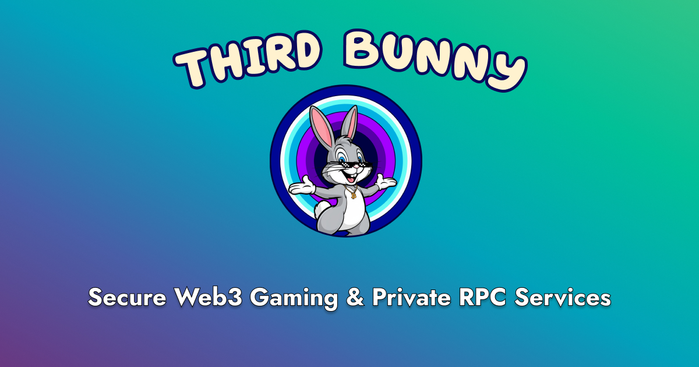

## Welcome to Third Bunny 👋

[Third Bunny](https://www.thirdbunny.xyz/) is a Web3 security service provider dedicated to empowering decentralized ecosystems. We offer a range of services designed to protect users from frontrunning, sandwich attacks, and malicious bots, while providing robust private RPC solutions. Whether you're a blockchain user, developer, or game studio, Third Bunny ensures that your transactions and smart contracts remain secure.

### Our Services

- **Private RPC Services**: Leverage our secure, private RPC endpoints to protect your transactions from malicious actors, preventing sandwich bots and other attacks.
- **Smart Transactions**: Safeguard your dApps with smart transactions that can be scheduled in advance and are protected against malicious actors like bots. Our solution guarantees that your transactions are executed securely and efficiently, without interference from frontrunning or other exploitative tactics.
- **Consulting Services**: We provide expert consultation in:
  - Smart Contract Design
  - Blockchain Security Consulting
  - Web3 Integration Consulting
- **Product Implementation Services**:
  - Custom Private RPC Setup
  - Anti-Bot Mechanism Development

### Build on Secure Foundations

With Third Bunny, you can build your dApps and blockchain projects on secure foundations. Whether you're developing an NFT marketplace, gaming dApp, or DeFi solution, we provide the tools to help you succeed and mitigate risks.

### Become a Delegator

Interested in contributing to our validator node? Join us in strengthening the blockchain ecosystem by becoming a delegator. Your participation helps maintain a secure and decentralized network.

- [Ronin Network Validator Profile](https://app.roninchain.com/validator/0x2c96d7b5d1887222025ec9f0be92fb91065d9d87)
- [Zeta Athens 3 Validator Profile](https://athens.explorer.zetachain.com/address/0x225254d35dE666064Eccc5ce16eF1D8bF8D7b5EE)

### Contribute to the Project

Third Bunny is constantly growing, and we welcome contributions from the community. Help us improve our security solutions, optimize private RPC performance, and develop anti-bot mechanisms.

- **Technologies**: Our protocols are implemented in Solidity for smart contracts, Go, and Node.js for blockchain nodes.
- **Repositories**: Check out our pinned repositories to start contributing.

### Responsible Disclosure

We take security seriously. If you discover a vulnerability or security issue, we encourage responsible disclosure. This allows us to address issues quickly and keep our community safe.

- [Contact us if you find any security vulnerabilities or bugs](mailto:thirdbunny.xyz).

### Get in Touch

- **Website**: [thirdbunny.xyz](https://www.thirdbunny.xyz/)
- **Follow us on X (Twitter)**: [Third Bunny](https://x.com/Third_Bunny) - our main contact point
- **Contact our spokesperson on Telegram**: [Crypto_Block](https://t.me/John_Prosperr)

---

[Linktree](https://linktr.ee/third_bunny) • [Website](https://www.thirdbunny.xyz/) • [Docs](#) • [X (Twitter)](https://x.com/Third_Bunny) • [Mail](mailto:thirdbunny.xyz) • [Developer Hub](https://github.com/thirdbunny) • [Ronin Validator Profile](https://app.roninchain.com/validator/0x2c96d7b5d1887222025ec9f0be92fb91065d9d87) • [Zeta Athens 3 Validator Profile](https://athens.explorer.zetachain.com/address/0x225254d35dE666064Eccc5ce16eF1D8bF8D7b5EE)
